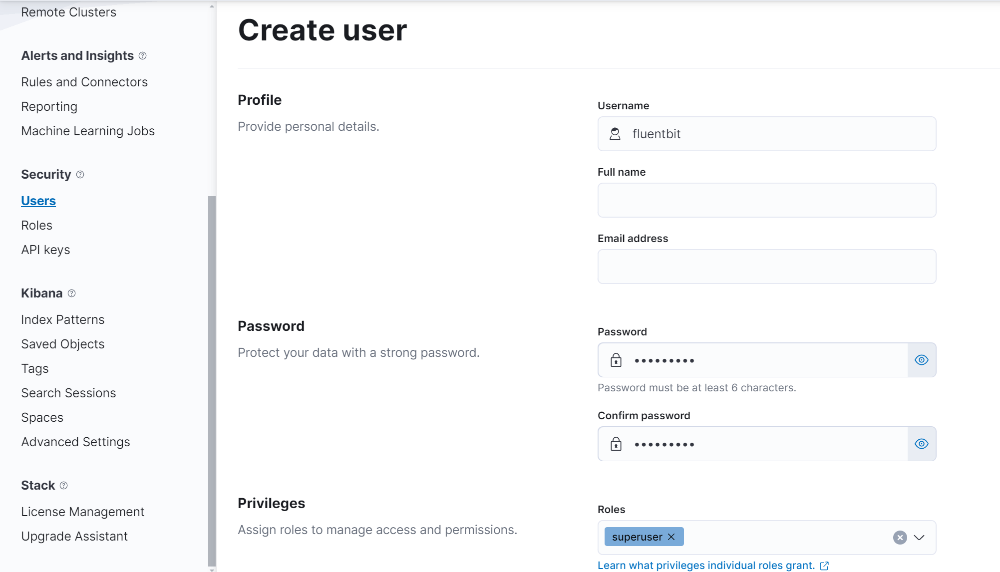
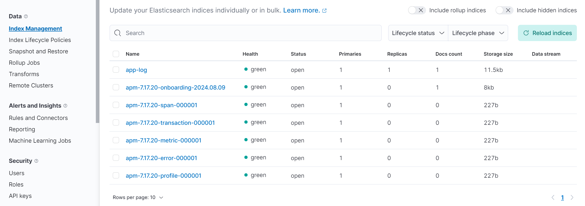
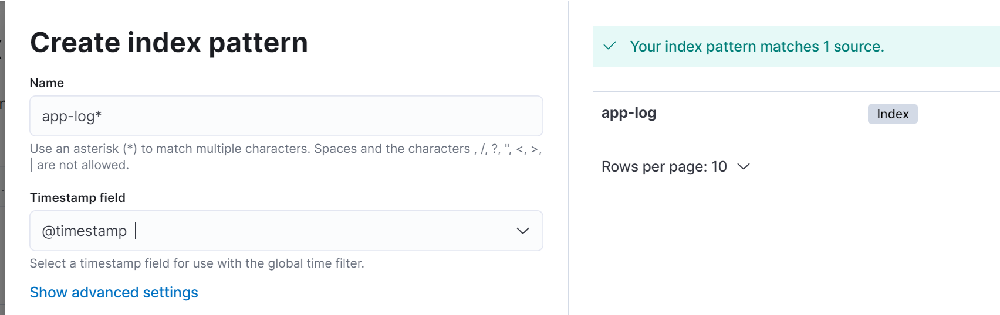
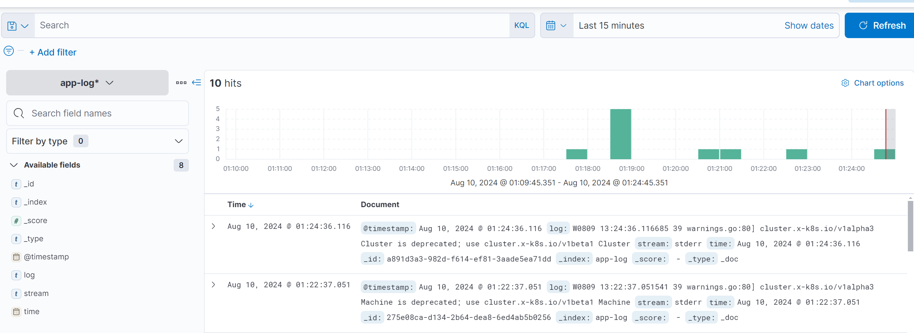
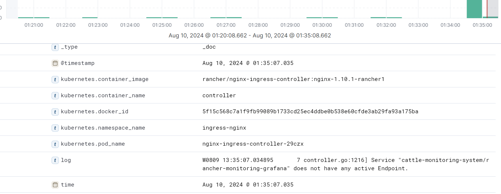
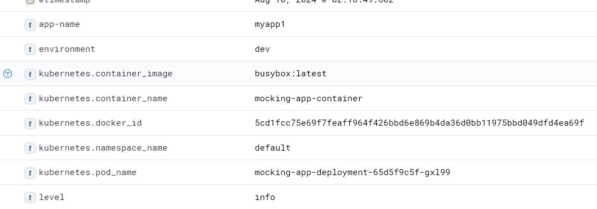
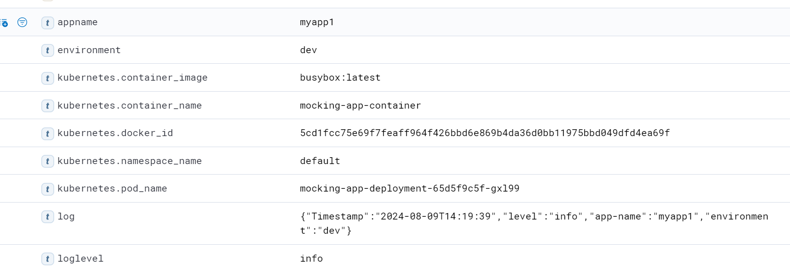

- OAMlab
- https://github.com/oamlab

# 使用FluentBit收集Kubernetes容器日志(Use FluentBit to collect Kubernetes container log)

---

## 环境和版本

操作系统

```
anson@k8s-1:~$ cat /etc/lsb-release 
DISTRIB_ID=Ubuntu
DISTRIB_RELEASE=24.04
DISTRIB_CODENAME=noble
DISTRIB_DESCRIPTION="Ubuntu 24.04 LTS"
```

Docker版本

```
anson@k8s-1:~$ docker version
Client: Docker Engine - Community
 Version:           26.1.4
 API version:       1.45
 Go version:        go1.21.11
 Git commit:        5650f9b
 Built:             Wed Jun  5 11:28:57 2024
 OS/Arch:           linux/amd64
 Context:           default
```

Kubernetes版本

```
Kubernetes v1.27.15
```

Fluent Operator

```
v3.0.0
```

Helm

```
v3.15.2
```


## Fluent Bit和Fluent Operator

### Fluent Bit

**Fluent Bit** 是一个轻量级、开源的日志处理工具，属于Fluentd项目的子项目。它专注于高效地收集、解析和转发日志数据。Fluent Bit的主要功能包括：

- **日志收集**：可以从各种来源（如文件、网络服务、系统日志）中收集日志数据。
- **日志处理**：支持对日志进行过滤、修改和格式化，如添加或删除字段，转换日志格式等。
- **日志转发**：将处理后的日志数据发送到多个目标，如ElasticSearch、Splunk、Kafka、CloudWatch等。
- **轻量级**：设计精简，适合资源受限的环境（如IoT设备和容器）。

### Fluent Operator

**Fluent Operator** 是一个用于管理Fluent Bit和Fluentd部署的Kubernetes Operator。Kubernetes Operator是一种用于将应用程序的操作逻辑（如部署、管理、扩展等）编码到Kubernetes控制器中的模式，Fluent Operator则专门用于简化和自动化Fluent Bit和Fluentd在Kubernetes环境中的管理。

在这个文档中我们将安装Fluent Operator来管理Fluent Bit。

## 安装Fluent Operator

下载

```bash
wget https://github.com/fluent/fluent-operator/releases/download/v3.0.0/fluent-operator.tgz
tar zxvf fluent-operator.tgz
```

修改`values.yaml`并定位到第74行，将fluentbit下的`enable`更改为`false`，这是指不使用helm模板中的`Fluent Bit`的组件。 

```bash
fluentbit:
  # Installs a sub chart carrying the CRDs for the fluent-bit controller. The sub chart is enabled by default.
  crdsEnable: true
  enable: false
```

安装Fluent Operator

进入到`fluent-operator`目录，使用`helm`命令进行安装，这个会安装相关的crds资源，以及创建`fluent-operator`容器。

```bash
anson@k8s-1:~/fluent-operator$ helm install -name fluent-operator -n logging --create-namespace -f values.yaml ./
NAME: fluent-operator
LAST DEPLOYED: Fri Aug  9 10:24:22 2024
NAMESPACE: logging
STATUS: deployed
REVISION: 1
TEST SUITE: None
NOTES:
Thank you for installing  fluent-operator
Your release is named    fluent-operator

To learn more about the release ,try:
   $ helm status  fluent-operator  -n  logging
   $ helm get  fluent-operator  -n logging

```

可以通过使用命令来查看`crds`资源。

```bash
kubectl get crds | grep fluent*
```

创建Fluent Bit

Fluent Operator会读取资源文件并创建和管理Fluent Bit，下面是一个简单的资源文件。

这个文件是FluentBit获取其所在节点的所有pod日志，打印收集的日志到标准输出。

```yaml
apiVersion: fluentbit.fluent.io/v1alpha2
kind: FluentBit
metadata:
  name: fluent-bit
  namespace: logging
  labels:
    app.kubernetes.io/name: fluent-bit
spec:
  image: kubesphere/fluent-bit:v3.1.4
  positionDB:
    hostPath:
      path: /var/lib/fluent-bit/
  resources:
    requests:
      cpu: 10m
      memory: 25Mi
    limits:
      cpu: 500m
      memory: 200Mi
  fluentBitConfigName: fluent-bit-config
---
apiVersion: fluentbit.fluent.io/v1alpha2
kind: ClusterFluentBitConfig
metadata:
  name: fluent-bit-config
  namespace: logging
  labels:
    app.kubernetes.io/name: fluent-bit
spec:
  service:
    parsersFile: parsers.conf
  inputSelector:
    matchLabels:
      fluentbit.fluent.io/enabled: "true"
      fluentbit.fluent.io/mode: "k8s"
  filterSelector:
    matchLabels:
      fluentbit.fluent.io/enabled: "true"
      fluentbit.fluent.io/mode: "k8s"
  outputSelector:
    matchLabels:
      fluentbit.fluent.io/enabled: "true"
      fluentbit.fluent.io/mode: "k8s"
---
apiVersion: fluentbit.fluent.io/v1alpha2
kind: ClusterInput
metadata:
  name: tail
  namespace: logging
  labels:
    fluentbit.fluent.io/enabled: "true"
    fluentbit.fluent.io/mode: "k8s"
spec:
  tail:
    tag: kube.*
    path: /var/log/containers/*.log
    excludePath: /var/log/containers/*_logging_*log
    # Exclude logs from util pod
    parser: docker   #If it is a containerd environment, then this item should be set to cri
    refreshIntervalSeconds: 10
    memBufLimit: 50MB
    skipLongLines: true
---
apiVersion: fluentbit.fluent.io/v1alpha2
kind: ClusterOutput
metadata:
  name: stdout
  namespace: logging
  labels:
    fluentbit.fluent.io/enabled: "true"
    fluentbit.fluent.io/mode: "k8s"
spec:
  matchRegex: (?:kube)\.(.*)
  stdout: {}
```

当我们使用命令查看Fluent Bit的pod日志内容时，可以看到

```bash
anson@k8s-1:~/fluent-operator$ kubectl logs -n logging fluent-bit-99xcl 
Fluent Bit v3.1.3
* Copyright (C) 2015-2024 The Fluent Bit Authors
* Fluent Bit is a CNCF sub-project under the umbrella of Fluentd
* https://fluentbit.io

______ _                  _    ______ _ _           _____  __  
|  ___| |                | |   | ___ (_) |         |____ |/  | 
| |_  | |_   _  ___ _ __ | |_  | |_/ /_| |_  __   __   / /`| | 
|  _| | | | | |/ _ \ '_ \| __| | ___ \ | __| \ \ / /   \ \ | | 
| |   | | |_| |  __/ | | | |_  | |_/ / | |_   \ V /.___/ /_| |_
\_|   |_|\__,_|\___|_| |_|\__| \____/|_|\__|   \_/ \____(_)___/

[2024/08/09 11:20:25] [ info] [fluent bit] version=3.1.3, commit=12a9de521c, pid=13
[2024/08/09 11:20:25] [ info] [storage] ver=1.5.2, type=memory, sync=normal, checksum=off, max_chunks_up=128
[2024/08/09 11:20:25] [ info] [cmetrics] version=0.9.1
[2024/08/09 11:20:25] [ info] [ctraces ] version=0.5.2
[2024/08/09 11:20:25] [ info] [input:tail:tail.0] initializing
[2024/08/09 11:20:25] [ info] [input:tail:tail.0] storage_strategy='memory' (memory only)
[2024/08/09 11:20:25] [ info] [sp] stream processor started
[2024/08/09 11:20:25] [ info] [input:tail:tail.0] inotify_fs_add(): inode=545609 watch_fd=1 name=/var/log/containers/canal-62lpr_kube-system_calico-node-221c7224a2aa9b0b668c0488f85b60ae3174eac85dc46b878b00bc3ae6b7b514.log
[2024/08/09 11:20:25] [ info] [input:tail:tail.0] inotify_fs_add(): inode=2240101 watch_fd=2 name=/var/log/containers/canal-62lpr_kube-system_calico-node-d785badbe8bd078b48e7da7f301efd74da6a4b4d05e866ddc878cd8cef1d9d6d.log
[2024/08/09 11:20:25] [ info] [input:tail:tail.0] inotify_fs_add(): inode=2239447 watch_fd=3 name=/var/log/containers/canal-62lpr_kube-system_install-cni-dad319547b256e34176c25fd7421a9a4a11ce1181577f4c168d0762e50a444b3.log
[2024/08/09 11:20:25] [ info] [input:tail:tail.0] inotify_fs_add(): inode=547612 watch_fd=4 name=/var/log/containers/canal-62lpr_kube-system_kube-flannel-af3a867bc242c0f8d00b5a42fb9b331b919a4e7c0e1d7da801e94da5b2ae08f7.log
```

FluentBit支持多种日志后端，下一部分我们将了解到如何对接及发送日志到Elasticsearch保存

## 安装Elastic Stack

在这里我们使用Docker-Compose方式部署Elasticsearch, Kibana, APM等组件。

克隆GitHub仓库	

```bash
git clone https://github.com/smallc2009/es-apm-stack.git
```

启动Elasticsearch

```bash
cd es-apm-stack
docker compose up -d
```

## 整合Elasticsearch

登录`Kibana`为`FluentBit`创建用户名和密码。

定位到`Stack Management`-> `Security`->`Users`->`Create User`，输入`username`和`password`。这里我们为了演示用户名和密码设置为`fluentbit`，Role的权限给`superuser`。 



在`logging`的命名空间下创建一个`secret`，文件如下。

```bash
apiVersion: v1
kind: Secret
metadata:
  name: fluentbit-elastic-secret
  namespace: logging
type: Opaque
data:
  elastic-username: Zmx1ZW50Yml0  # fluentbit 的Base64编码
  elastic-password: Zmx1ZW50Yml0  # fluentbit 的Base64编码
```

更新FluentBit资源文件

```yaml
apiVersion: fluentbit.fluent.io/v1alpha2
kind: ClusterOutput
metadata:
  name: app-logs-k8s
  namespace: logging
  labels:
    fluentbit.fluent.io/enabled: "true"
    fluentbit.fluent.io/mode: "k8s"
    app.kubernetes.io/name: fluent-bit
spec:
  matchRegex: (?:kube)\.(.*)
  es:
    host: 192.168.1.99
    port: 9200
    httpUser:
      valueFrom:
        secretKeyRef:
          key: elastic-username
          name: fluentbit-elastic-secret
    httpPassword:
      valueFrom:
        secretKeyRef:
          key: elastic-password
          name: fluentbit-elastic-secret
    generateID: true
    index: app-log
    bufferSize: 10M
    tls:
      verify: Off
```

在`Kibana`的`Index Management`中查看是否有`app-log`的索引生成



创建索引样式匹配

定位到`Stack Management`->`kibana`->`Index Patterns` 创建索引样式



查看日志

返回到主页面在`Analytics`->`Discovery`下则可以看到已经收集到日志



## k8s Metadata

`Kubernetes`的`Metadata`信息可以丰富日志内容，如日志来自哪个命令空间，哪个pod，还可以自定义移除一些不需要的信息。

这里增加一个ClusterFilter来获取信息

```yaml
apiVersion: fluentbit.fluent.io/v1alpha2
kind: ClusterFilter
metadata:
  name: kubernetes
  namespace: logging
  labels:
    fluentbit.fluent.io/enabled: "true"
    fluentbit.fluent.io/mode: "k8s"
spec:
  match: kube.*
  filters:
    - kubernetes:
        kubeURL: https://kubernetes.default.svc:443
        kubeCAFile: /var/run/secrets/kubernetes.io/serviceaccount/ca.crt
        kubeTokenFile: /var/run/secrets/kubernetes.io/serviceaccount/token
        labels: false
        annotations: false
    - nest:
        operation: lift
        nestedUnder: kubernetes
        addPrefix: kubernetes_
    - modify:
        rules:
          - remove: stream
          - remove: kubernetes_pod_id
          - remove: kubernetes_host
          - remove: kubernetes_container_hash
    - nest:
        operation: nest
        wildcard:
          - kubernetes_*
        nestUnder: kubernetes
        removePrefix: kubernetes_
```

再次查看`Kibana`，我们可以看到日志有更丰富的信息



## 字段转换

下面`Yaml`文件是简单的模拟应用的例子，其打印json格式的结构化日志。

假如现在由于规范，希望将日志字段`app-name`更名为`appname`，`level`更改为`loglevel`，但开发层面因为涉及过多，暂时无法更改，从而使用fluentbit来实现。

```yaml
apiVersion: apps/v1
kind: Deployment
metadata:
  name: mocking-app-deployment
  labels:
    app: mocking-app
spec:
  replicas: 1
  selector:
    matchLabels:
      app: mocking-app
  template:
    metadata:
      labels:
        app: mocking-app
    spec:
      containers:
      - name: mocking-app-container
        image: busybox
        args:
        - /bin/sh
        - -c
        - >
          while true; do
            CURRENT_TIMESTAMP=$(date +"%Y-%m-%dT%H:%M:%S")
            echo '{"Timestamp":"'$CURRENT_TIMESTAMP'","level":"info","app-name":"myapp1","environment":"dev"}';
            sleep 2;
          done
```

当`mocking-app`部署之后，查看日志可以看到其输出结构化日志。

```bash
anson@k8s-1:~/demo$ kubectl logs mocking-app-deployment-65d5f9c5f-gxl99 
{"Timestamp":"2024-08-09T14:13:47","level":"info","app-name":"myapp1","environment":"dev"}
{"Timestamp":"2024-08-09T14:13:49","level":"info","app-name":"myapp1","environment":"dev"}
```

同时我们在`Kibana`中查看，`app-name`和`level`两个字段跟pod终端中打印出来是一样的



资源文件更新，在`modify`下增加`rename`模块

```yaml
apiVersion: fluentbit.fluent.io/v1alpha2
kind: ClusterFilter
metadata:
  name: kubernetes
  namespace: logging
  labels:
    fluentbit.fluent.io/enabled: "true"
    fluentbit.fluent.io/mode: "k8s"
spec:
  match: kube.*
  filters:
    - kubernetes:
        kubeURL: https://kubernetes.default.svc:443
        kubeCAFile: /var/run/secrets/kubernetes.io/serviceaccount/ca.crt
        kubeTokenFile: /var/run/secrets/kubernetes.io/serviceaccount/token
        labels: false
        annotations: false
        mergeLog: true
    - nest:
        operation: lift
        nestedUnder: kubernetes
        addPrefix: kubernetes_
    - modify:
        rules:
          - remove: stream
          - remove: kubernetes_pod_id
          - remove: kubernetes_host
          - remove: kubernetes_container_hash
    - nest:
        operation: nest
        wildcard:
          - kubernetes_*
        nestUnder: kubernetes
        removePrefix: kubernetes_
    - modify:
        rules:
          - rename:
              level: loglevel
              app-name: appname
```

再次查看elastic

`app-name`已经变成`apname`，`level`已经变成了`loglevel`



## 总结

在这篇文章中我们了解了`FluentBit`是如何收集`Kubernetes`上的`pod`日志，使用`elasticsearch`作为后端来整合并存储日志，此外我们还了解到增加`kubernetes`的`metadata`以及字段转换的配置。`FluentBit`功能远不止如此，它还支持自定义lua脚本，可以通过编写复杂的lua脚本来实现对日志更多的处理。此外FluentBit还支持收集和处理`Metrics`和`Trace`。